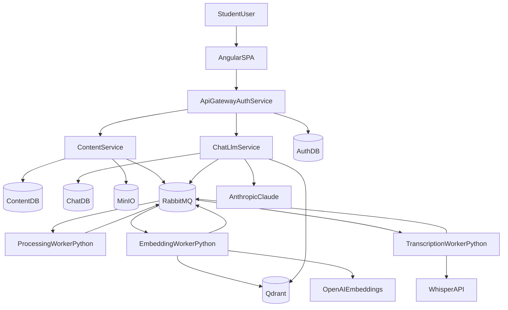

# StudyMind

StudyMind is a distributed AI study platform where users upload PDFs or YouTube links and immediately turn passive content into active learning.
It uses Retrieval-Augmented Generation (RAG) to answer questions, generate summaries, create quizzes, and build flashcards based only on user-owned material.

## Product Value

- Upload a PDF or YouTube lesson and chat with the content
- Get grounded answers with source chunks and video timestamps
- Generate study assets (summaries, quizzes, flashcards)
- Track progress over time

## Architecture (Microservices from Day 1)




## Tech Stack


| Layer         | Choice                                          |
| ------------- | ----------------------------------------------- |
| Core services | Java 21 + Spring Boot 4 (3 services)            |
| Frontend      | Angular 17+ + PrimeNG + Signals                 |
| Workers       | Python 3.11 (consumer workers)                  |
| Relational DB | PostgreSQL 16                                   |
| Vector DB     | Qdrant                                          |
| Queue         | RabbitMQ (Kafka-ready abstraction)              |
| File Storage  | MinIO (dev) / S3 (prod)                         |
| AI Providers  | Anthropic Claude + OpenAI Embeddings + Whisper  |
| Infra         | Docker Compose (MVP), Kubernetes optional later |


## Repository Structure

```text
StudyMind/
├── README.md
├── RULES.md                    # the rules this repo is held to, and what enforces each
├── CLAUDE.md
├── docker-compose.yml
├── .env.example
├── .spectral.yaml              # OpenAPI ruleset, run in CI
├── .github/workflows/ci.yml    # backend, frontend, python, contracts, openapi
├── contracts/
│   └── events/v1/              # JSON Schemas for every RabbitMQ event
├── docs/
│   ├── README.md
│   ├── DEPLOYMENT.md
│   ├── architecture/           # ARCHITECTURE, DATA-MODEL, EVENTS, adr/
│   └── development/            # setup and per-service guides
├── services/
│   ├── api-gateway-auth/       # JWT auth and edge routing (scaffold)
│   ├── content-service/        # PDF and YouTube ingestion (implemented)
│   └── chat-llm-service/       # RAG chat (scaffold)
└── tools/
    └── contracts/              # validates the event schemas, generates the wire types
```

The Python workers and the Angular SPA in the diagram above do not exist yet. CI discovers
`services/*/pom.xml`, every `pyproject.toml` and `frontend/package.json`, so each of them is built
and tested from the first commit that adds it.

### Why one content-service and not document + video

PDF upload and YouTube submission are two ways of naming a source for the same thing: a unit of
content owned by a user. Split across two services they duplicated the resource, the ownership
endpoint and the event shape, while everything downstream (`ChunksCreated`, `ContentIndexed`)
already discriminated on a single `type` field. They are now one service with a sealed
`ContentSource` — one seam, two adapters. A third source is a new variant, not a new deployable.

## Quick Start

```bash
git clone <your-repo-url> && cd StudyMind
cp .env.example .env            # compose declares no defaults and fails without this
docker compose up -d            # Postgres x3, RabbitMQ, Qdrant, MinIO + bucket init
cd services/content-service && ./mvnw verify
```

`./mvnw verify` needs no Docker: it compiles, runs the tests and enforces the coverage gate against
an in-memory blob store and the schema files on disk.

Full walkthrough, including the contracts tool and the OpenAPI linter:
[`docs/development/00-environment-setup.md`](docs/development/00-environment-setup.md).

## Continuous Integration

Every push and pull request runs [`.github/workflows/ci.yml`](.github/workflows/ci.yml):

| Job | What it does |
| --- | --- |
| `backend` | `./mvnw -B -ntp verify` per service — build, test, and a **90% line and branch coverage gate** |
| `frontend` | `npm ci`, lint and tests, once `frontend/package.json` exists |
| `python` | `ruff check`, `ruff format --check` and `pytest` for every `pyproject.toml` |
| `contracts` | every event schema is valid Draft 2020-12 with resolving `$ref`s, and the generated wire types are current |
| `openapi` | Spectral over `services/*/openapi/openapi.yaml` against [`.spectral.yaml`](.spectral.yaml) |
| `ci` | one job to require in branch protection; it aggregates the rest |

The coverage gate lives in each service's POM rather than only in the workflow, so `./mvnw verify`
fails locally for the same reason CI does.

## Roadmap

- Phase 1: PDF upload + asynchronous indexing + chat RAG
- Phase 2: YouTube ingestion + transcription + timestamped answers
- Phase 3: Summaries + quizzes + flashcards + progress tracking
- Phase 4: Observability + reliability + deployment hardening

## Documentation Map

- Rules the repository is held to: [`RULES.md`](RULES.md)
- Documentation index: [`docs/README.md`](docs/README.md)
- Core architecture: [`docs/architecture/ARCHITECTURE.md`](docs/architecture/ARCHITECTURE.md)
- Data and storage model: [`docs/architecture/DATA-MODEL.md`](docs/architecture/DATA-MODEL.md)
- Event contracts and reliability: [`docs/architecture/EVENTS.md`](docs/architecture/EVENTS.md)
- Design decisions (ADRs): [`docs/architecture/adr/`](docs/architecture/adr/)
- Build guides: [`docs/development/`](docs/development/)
- Deployment: [`docs/DEPLOYMENT.md`](docs/DEPLOYMENT.md)

## Portfolio Positioning

This project demonstrates:

- microservices-first architecture with clear service ownership
- event-driven architecture with contracts that are validated in CI rather than described
- code generated from those contracts, so a renamed field is a compile error
- a RAG design where tenant isolation is a filter at every layer, not a convention
- a build that a stranger can clone and run, and a CI pipeline that covers every language in it

What it does not yet demonstrate, stated because the architecture documents say so too: the
asynchronous workers, the RAG retrieval itself, and the reliability patterns (transactional outbox,
failure events, retries, DLQ) that
[EVENTS.md](docs/architecture/EVENTS.md#reliability-and-what-is-missing) lists as missing.

