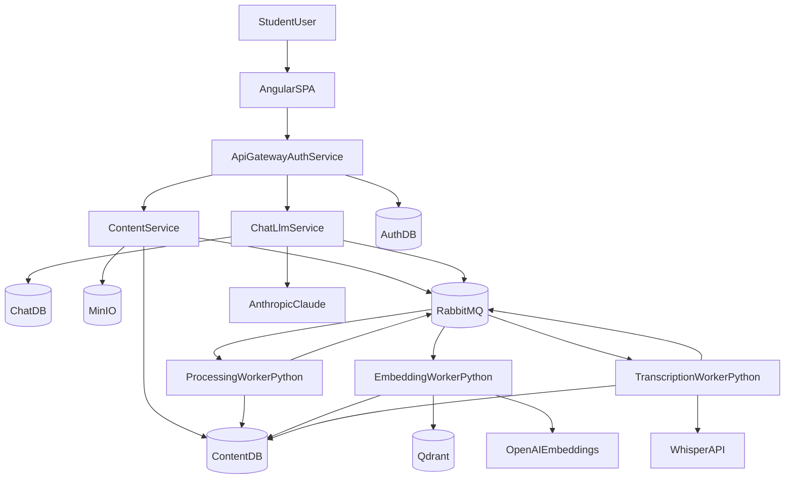

# StudyMind

StudyMind is a distributed AI study platform where users upload PDFs or YouTube links and immediately turn passive content into active learning.
It uses Retrieval-Augmented Generation (RAG) to answer questions, generate summaries, create quizzes, and build flashcards based only on user-owned material.

## Product Value

- Upload a PDF or YouTube lesson and chat with the content
- Get grounded answers with source chunks and video timestamps
- Generate study assets (summaries, quizzes, flashcards)
- Track progress over time

## Architecture (Microservices from Day 1)




## Tech Stack


| Layer         | Choice                                          |
| ------------- | ----------------------------------------------- |
| Core services | Java 21 + Spring Boot 4 (3 services)            |
| Frontend      | Angular 17+ + PrimeNG + Signals                 |
| Workers       | Python 3.11 (consumer workers)                  |
| Relational DB | PostgreSQL 16                                   |
| Vector DB     | Qdrant                                          |
| Queue         | RabbitMQ (Kafka-ready abstraction)              |
| Cache         | Redis 7                                         |
| File Storage  | MinIO (dev) / S3 (prod)                         |
| AI Providers  | Anthropic Claude + OpenAI Embeddings + Whisper  |
| Infra         | Docker Compose (MVP), Kubernetes optional later |


## Repository Structure

```text
StudyMind/
├── README.md
├── CLAUDE.md
├── docker-compose.yml
├── .env.example
├── contracts/
│   └── events/v1/              # JSON Schemas for every RabbitMQ event
├── services/
│   ├── api-gateway-auth/       # JWT auth and edge routing (scaffold)
│   ├── content-service/        # PDF and YouTube ingestion (implemented)
│   └── chat-llm-service/       # RAG chat (scaffold)
└── docs/                       # not in git; see .gitignore
    ├── architecture/
    │   ├── ARCHITECTURE.md
    │   ├── DATA-MODEL.md
    │   ├── EVENTS.md
    │   └── adr/
    ├── development/
    │   ├── 00-environment-setup.md
    │   ├── 01-api-gateway-auth.md
    │   ├── 02-content-service.md
    │   ├── 03-processing-worker.md
    │   ├── 04-embedding-worker.md
    │   ├── 05-chat-rag-service.md
    │   ├── 06-transcription-worker.md
    │   ├── 07-quiz-flashcard-service.md
    │   ├── 08-frontend.md
    │   └── 09-observability-deploy.md
    └── DEPLOYMENT.md
```

### Why one content-service and not document + video

PDF upload and YouTube submission are two ways of naming a source for the same thing: a unit of
content owned by a user. Split across two services they duplicated the resource, the ownership
endpoint and the event shape, while everything downstream (`ChunksCreated`, `ContentIndexed`)
already discriminated on a single `type` field. They are now one service with a sealed
`ContentSource` — one seam, two adapters. A third source is a new variant, not a new deployable.

## Quick Start (Documentation-First Setup)

1. Clone and enter project:
  - `git clone <your-repo-url>`
  - `cd StudyMind`
2. Read setup guide:
  - `docs/development/00-environment-setup.md`
3. Configure environment variables:
  - `cp .env.example .env` — compose declares no defaults and fails without it
4. Bring infra up:
  - `docker compose up -d`
5. Build and test a service:
  - `cd services/content-service && ./mvnw verify`
6. Implement in order:
  - follow numbered files in `docs/development/`

## Roadmap

- Phase 1: PDF upload + asynchronous indexing + chat RAG
- Phase 2: YouTube ingestion + transcription + timestamped answers
- Phase 3: Summaries + quizzes + flashcards + progress tracking
- Phase 4: Observability + reliability + deployment hardening

## Documentation Map

- Core architecture: `docs/architecture/ARCHITECTURE.md`
- Data and storage model: `docs/architecture/DATA-MODEL.md`
- Event contracts and reliability: `docs/architecture/EVENTS.md`
- Design decisions (ADRs): `docs/architecture/adr/`
- Step-by-step build guide: `docs/development/`
- Production deployment: `docs/DEPLOYMENT.md`

## Portfolio Positioning

This project demonstrates:

- microservices-first architecture with clear service ownership
- event-driven architecture with asynchronous workers
- real RAG system with vector search and tenant filtering
- multi-provider AI integration with structured outputs
- reliability patterns (idempotency, retries, DLQ)
- production-oriented observability and deployment practices

