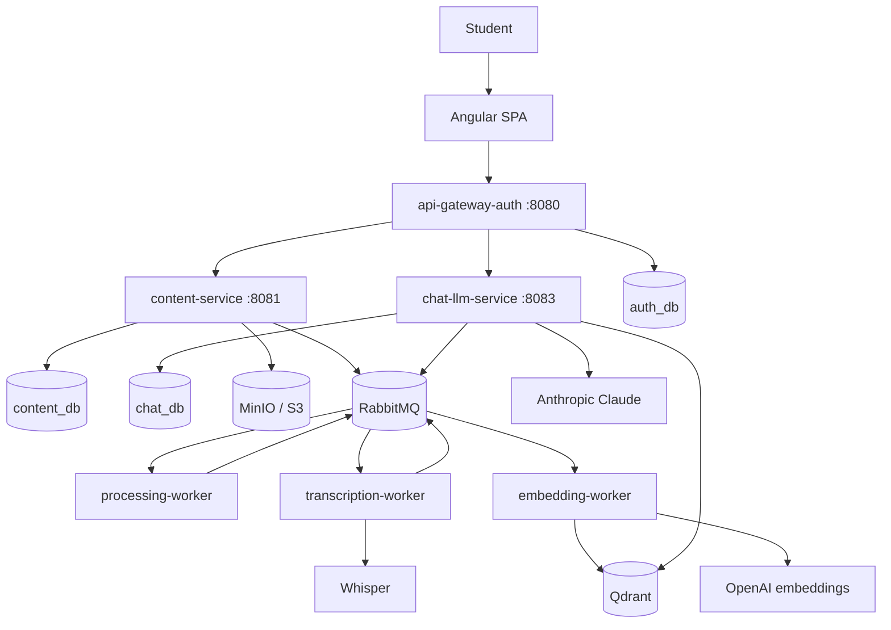

# Architecture

StudyMind turns a user's own material — a PDF or a YouTube lesson — into something they can ask
questions of. The answer has to come from *their* material and nothing else, which is the single
constraint that shapes most of what follows.

## The shape of the system

Three Java services, three Python workers, and one SPA. What is implemented today is listed in
[the repository README](../../README.md); this document describes the whole design so the
half that exists can be read in the context of the half that does not.

## Why these boundaries and not others

A service boundary is worth its cost when the two sides have different reasons to change. The four
in this system do:

- **api-gateway-auth** owns identity. It is the only service that sees a JWT, the only one that
  holds credentials, and the only one exposed to the internet. Everything else in the system trusts
  the `X-User-Id` header it sets, which is why the other services must not be reachable from
  outside the internal network.
- **content-service** owns the *inventory*: what material a user has, what state it is in, and
  where the bytes live. It is synchronous, transactional and boring on purpose.
- **the workers** own the expensive, failure-prone, provider-dependent work: parsing a PDF,
  transcribing an hour of audio, calling an embeddings API. They are separate processes because
  they need to fail, retry and scale independently of a user waiting on an HTTP response.
- **chat-llm-service** owns the retrieval and the conversation. It is the only service that talks
  to the LLM, and it reads the vector store rather than any other service's database.

[ADR-0001](adr/0001-merge-document-and-video-into-content-service.md) covers the boundary that was
*removed*: document-service and video-service were one service all along.

## The path a document takes

Everything asynchronous in this system follows one shape: a service commits a fact, announces it,
and a worker picks it up.

1. `POST /contents` arrives at content-service with a PDF part or a JSON body holding a YouTube URL.
2. Ingestion validates the source, writes the PDF bytes to object storage, saves a `content` row
   with status `PENDING`, and publishes `ContentSubmitted`. The bytes land *before* the event, so a
   worker consuming it can always read `storage_path`.
3. `processing-worker` (PDF) or `transcription-worker` (video) does the extraction and publishes
   `ChunksCreated`.
4. `embedding-worker` embeds those chunks, upserts them into Qdrant with `user_id` in the payload,
   and publishes `ContentIndexed`.
5. A question to chat-llm-service embeds the query, searches Qdrant **filtered by `user_id`**, and
   asks Claude to answer using only the retrieved chunks.

The user sees `PENDING → PROCESSING → INDEXED` on their content, and is told to wait rather than
being made to wait. See [EVENTS.md](EVENTS.md) for the contract each of those events satisfies.

## Tenant isolation

The product promise is "answers from your material only", so `user_id` is not metadata. It is a
key that has to survive every hop:

- every event payload carries `user_id` alongside `content_id`, enforced by the contract validator;
- every read method on `ContentCatalog` takes the owning `userId` as its first argument, so there
  is no unscoped read path in content-service;
- every chunk stored in Qdrant carries `user_id` in its payload, and every vector search filters on
  it *before* similarity is considered;
- a request for content the caller does not own returns 404, not 403 — the existence of another
  user's content is itself not theirs to learn.

A leak here is the worst bug this system can have, which is why the check is repeated at every
layer rather than trusted once at the edge.

## Storage, and what owns what

| Store | Owner | Holds |
| --- | --- | --- |
| `auth_db` (Postgres) | api-gateway-auth | users, credentials, refresh tokens |
| `content_db` (Postgres) | content-service | the `content` table: inventory and status |
| `chat_db` (Postgres) | chat-llm-service | sessions and messages |
| MinIO / S3 | content-service | raw uploaded PDFs under `raw/{user_id}/{content_id}/{file_name}` |
| Qdrant | embedding-worker (writes), chat-llm-service (reads) | chunk vectors with their text and `user_id` |

No service reads another service's database. The workers are the one place this needs care: they
run alongside content-service's data but reach it through events and object storage, not through
its schema. [DATA-MODEL.md](DATA-MODEL.md) goes through each store, and
[ADR-0002](adr/0002-chunks-are-a-storage-artifact.md) explains why chunks are not rows in
`content_db`.

## Synchronous seams

Only one internal HTTP call exists: `GET /internal/contents?ids=…` on content-service, which reports
readiness for a batch of contents belonging to the caller. It replaced two per-service ownership
endpoints, and it is a candidate for deletion — if retrieval filters the vector search by user, a
caller asking about content it does not own simply gets no chunks and the check is redundant. It
survives only to answer "is this indexed yet".

Everything else between services is an event. That is deliberate: a synchronous call couples
availability, and the workers are the parts most likely to be down.

## Where this design is currently weak

Worth knowing before reading the code and assuming it is finished:

- **content-service publishes inside its transaction.** A broker failure after commit loses the
  event, making delivery at-most-once. The fix is a transactional outbox; it is not implemented.
- **There are no failure events.** `ProcessingFailed`, `TranscriptionFailed` and `IndexingFailed`
  have no contracts, so a content that fails processing has no defined path to the `FAILED` status.
- **There are no DLQ or retry conventions** in the contracts, although the README sells
  idempotency and retries as a differentiator.
- **`chunks` has no schema of its own** beyond what Qdrant holds, so re-embedding requires
  re-extracting.

## Technology, and why

| Layer | Choice | Reason |
| --- | --- | --- |
| Core services | Java 21, Spring Boot 4 | the transactional, boring half of the system |
| Workers | Python 3.11 | the PDF, audio and embedding ecosystems live here |
| Relational | PostgreSQL 16, one database per service | ownership is enforced by the deployment, not by convention |
| Vector | Qdrant | payload filtering on `user_id` is a first-class query, not a post-filter |
| Queue | RabbitMQ, topic exchange | routing keys let a worker bind coarsely and filter on `type` |
| Object storage | MinIO in dev, S3 in prod | one S3 adapter, different endpoint |
| Contracts | JSON Schema 2020-12, OpenAPI 3 | written before the code, checked in CI |

Redis is deliberately absent; see
[ADR-0003](adr/0003-remove-redis-until-something-needs-it.md).
