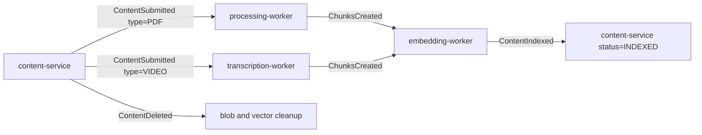

# Events and reliability

Everything asynchronous in StudyMind goes through one topic exchange with one envelope. The
schemas in [`contracts/events/v1/`](../../contracts/events/v1/) are the source of truth: they are
validated in CI, the publishing service's Java types are generated from them, and its test suite
validates every envelope it produces against the files on disk.

## The envelope

Every message on the exchange has the same seven fields, defined by
[`event-envelope.v1.schema.json`](../../contracts/events/v1/event-envelope.v1.schema.json):

```json
{
  "event_id": "9f1c…",
  "event_type": "ContentSubmitted",
  "event_version": "v1",
  "occurred_at": "2026-09-17T12:00:00Z",
  "source_service": "content-service",
  "correlation_id": "4a7b…",
  "payload": { }
}
```

The envelope is what lets a consumer log, correlate, deduplicate and dead-letter a message it does
not otherwise understand:

- **`event_id`** is the idempotency key. A consumer that has already processed this id must not
  process it again — RabbitMQ delivers at least once, and so redelivery is normal, not exceptional.
- **`correlation_id`** is the request that caused it. In content-service it comes from the
  `X-Correlation-Id` header via the MDC, so a log line in a Python worker can be traced back to the
  HTTP call that started the chain without anyone threading an argument through.
- **`event_version`** is pinned to `v1` by the schema. A breaking change gets a `v2` *file*, not an
  edit to this one.

No caller builds an envelope. In content-service every field above is derived inside
`RabbitEventPublisher` — `event_id` is a fresh UUID, `occurred_at` comes from an injected `Clock`,
`correlation_id` from the MDC, `source_service` from `spring.application.name`. The publishing
interface takes a payload and nothing else.

## The flow



| Event | Emitted by | Routing key | Carries |
| --- | --- | --- | --- |
| `ContentSubmitted` | content-service | `content.submitted` | `content_id`, `user_id`, `type`, and either `storage_path` + `file_name` or `source_url` |
| `ChunksCreated` | processing-worker **or** transcription-worker | `content.chunks.created` | `chunk_ids`, `chunk_count`, `has_timestamps` |
| `ContentIndexed` | embedding-worker | `content.indexed` | `indexed_chunk_count`, `qdrant_collection` |
| `ContentDeleted` | content-service | `content.deleted` | `type`, `storage_path` |
| `AnswerGenerated` | chat-llm-service | `chat.answer.generated` | the chunks and model behind an answer; analytics only |

Only the two content-service routing keys are implemented today; the rest are the contract the
workers will be written against.

### One event, two types, one routing key

`ContentSubmitted` carries a `type` discriminator rather than being two events. The routing key
stays coarse — `content.submitted` — so a consumer binds once and filters on `payload.type`. This
is the same decision as [ADR-0001](adr/0001-merge-document-and-video-into-content-service.md), seen
from the queue: the downstream events `ChunksCreated` and `ContentIndexed` already discriminated on
a single `type` field, so having two upstream event names was the part that did not fit.

The schema enforces the conditional shape with `if`/`then` on `type`: a `PDF` payload must have
`storage_path` and `file_name`, a `VIDEO` payload must have `source_url`.

## Conventions every schema follows

These are checked by `studymind-contracts validate` in CI, not just written down here:

- the file is named `<event-name>.v<n>.schema.json` and its `$id` ends with that same name;
- it declares JSON Schema Draft 2020-12 and is itself valid against the metaschema;
- it `allOf`s the envelope, and every `$ref` resolves to a file that exists;
- it pins `event_type` to a `const`, and no two schemas claim the same one;
- the payload is `additionalProperties: false`, and every field name is snake_case;
- **every payload has a required `user_id`** — the tenant key has to reach the Qdrant filter, and a
  payload without it produces a chunk nobody can safely scope;
- the README in `contracts/events/v1/` lists exactly the events that have files.

`source_service` is pinned to a `const` where exactly one service emits the event. `ChunksCreated`
deliberately does not pin it: both processing-worker and transcription-worker produce it.

## Generated wire types

The Java records a publisher builds its payloads from are generated from these schemas into
`com.contentservice.events.wire` and checked in. The generated type exposes a builder with one
setter named after each contract field, so renaming `storage_path` in the schema stops
`RabbitEventPublisher` from compiling. CI regenerates and fails if the checked-in files differ.
See [ADR-0004](adr/0004-generate-wire-types-from-the-event-contracts.md).

The *envelope* is still assembled by hand as an explicit `Map`, because its fields are derived
rather than passed in, and because the wire contract must not move when someone renames a Java
record component.

## Reliability, and what is missing

What holds today:

- messages are published persistent, to a durable topic exchange;
- `event_id` gives every consumer an idempotency key;
- the contract test in content-service validates real published envelopes against the real schema
  files, so a schema change that the publisher does not follow fails the build.

What does not hold yet, stated plainly because the README sells some of it as a differentiator:

- **Publishing happens inside the database transaction.** If the broker is unreachable after the
  commit, the event is lost — delivery is at-most-once, not at-least-once. The fix is a
  transactional outbox: write the event to an `outbox` table in the same transaction, and have a
  relay publish and mark it sent. Not implemented.
- **No failure events.** `ProcessingFailed`, `TranscriptionFailed` and `IndexingFailed` have no
  contracts, so nothing drives a content to `FAILED` and a user sees a `PROCESSING` that never ends.
- **No DLQ or retry convention.** There is no agreed dead-letter exchange, no retry count in the
  envelope, and no documented backoff. Each worker would currently invent its own.
- **No consumer is idempotent yet**, because no consumer exists yet. The mechanism is specified;
  the enforcement is not.

Adding any of these means adding or changing a contract in `contracts/events/v1/` in the same commit
as the code, which is the rule the whole contracts directory exists to make possible.
